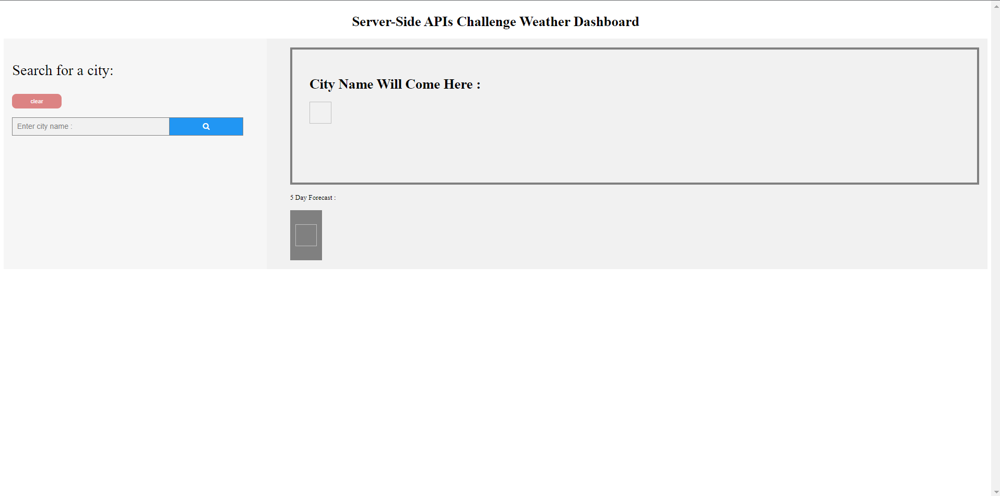
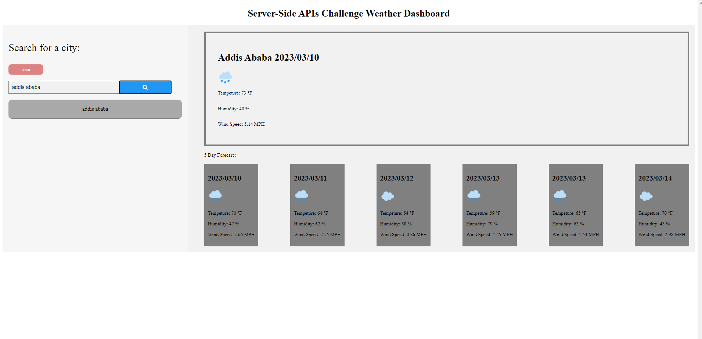
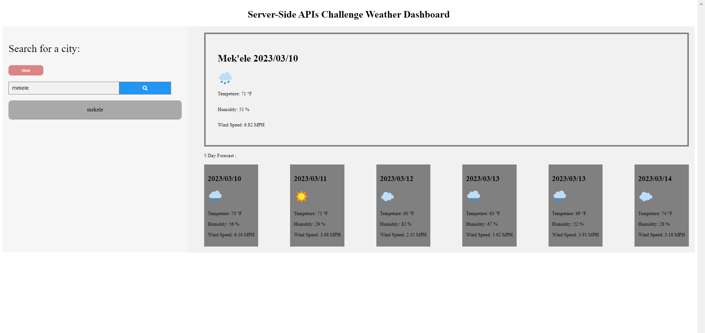
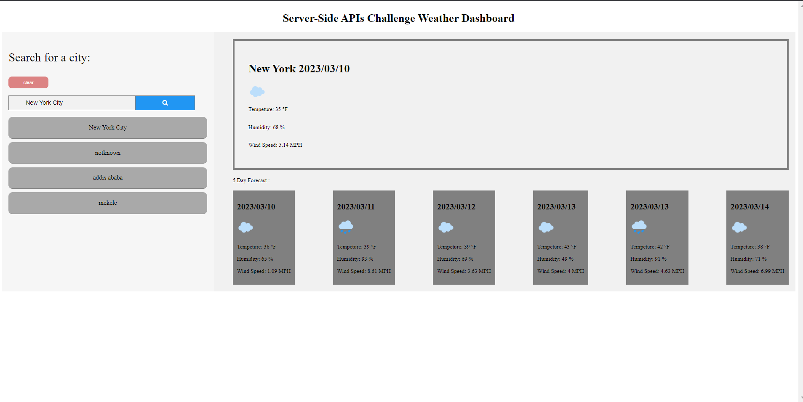
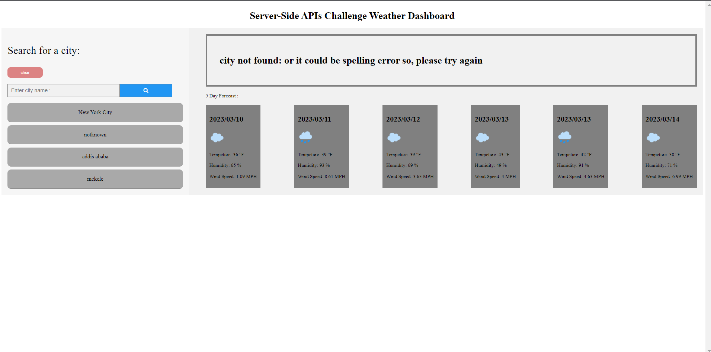

# Server-side apis challenge weather dashboard

# Description:

server-side apis challenge weather dashboard is a web application that uses HTML * CSS * JavaScript * jQuery  that will help  you to  predict a cities weather upto five days.

# Usage:

Simply search a city that want to see it's weather and  hit the search button.
Then you will see the City name, Current day, Weather icon, Tempeture:, Humidity, Wind Speed on the top and you will also see 5 day weather forecast at the bottom.

# Technology Used:

* HTML
* CSS
* JavaScript
* jQuery

# Installation

first of all you need to have Node invironment in your local machine to run javascript file

step 1 : clone my repository to your local machine

step 2 :  open in terminal if you are in mac or linux operating system or in command prompt if you are in window

step 3 : type this command  ( cd server-side apis challenge weather dashboard  ) to navigate to the project

step 4 : type this command ( code .) this helps to open in VS code

step 5 : when you are in VS code click the terminal tab from the VS code to open a terminal from VS code

step 6 : then type git status or git branch and make sure you are on the main branch

step 7 : finally go to the index.html run it . just open it using live server and see the result

step 9 :Simply search a city that want to see it's weather and  hit the search button.
Then you will see the City name, Current day, Weather icon, Tempeture:, Humidity, Wind Speed on the top and you will also see 5 day weather forecast at the bottom.

# Screenshots:

**Done!  congratulations**

Website Link :
